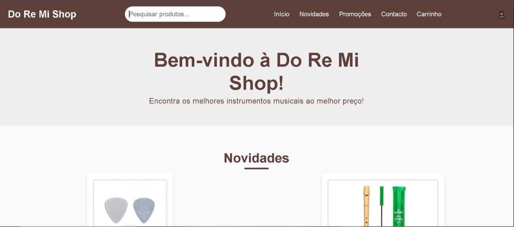
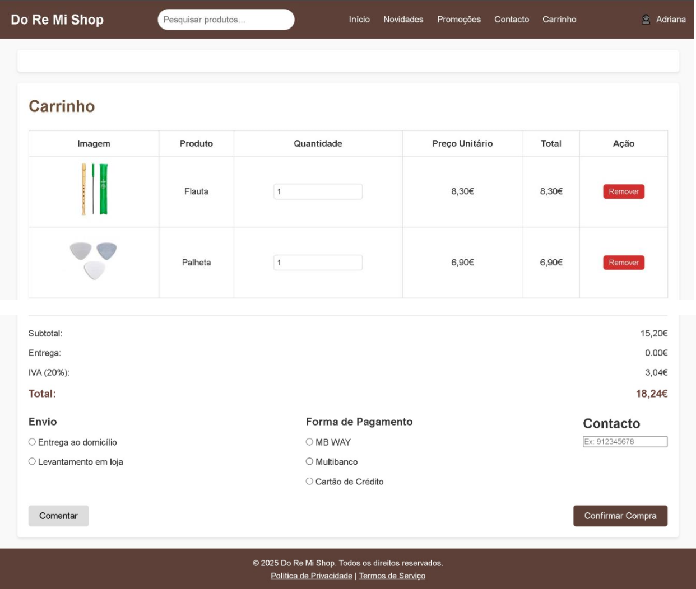
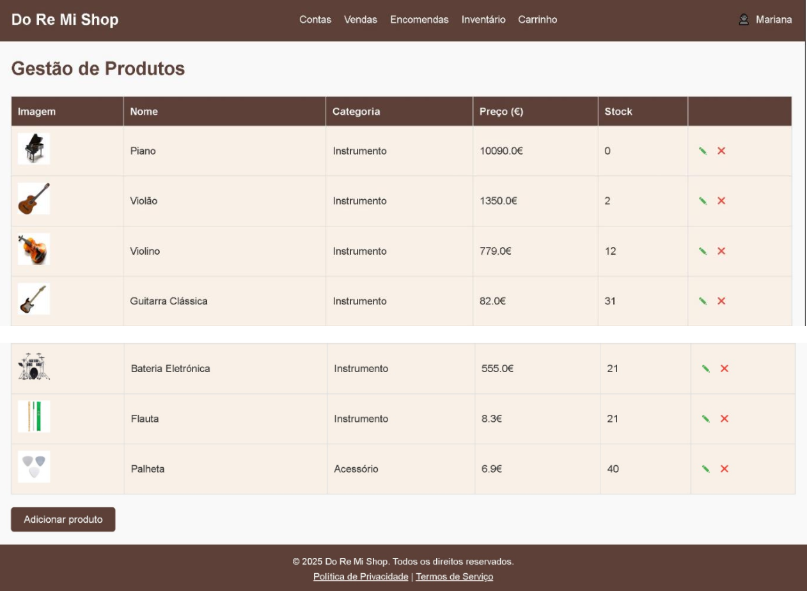
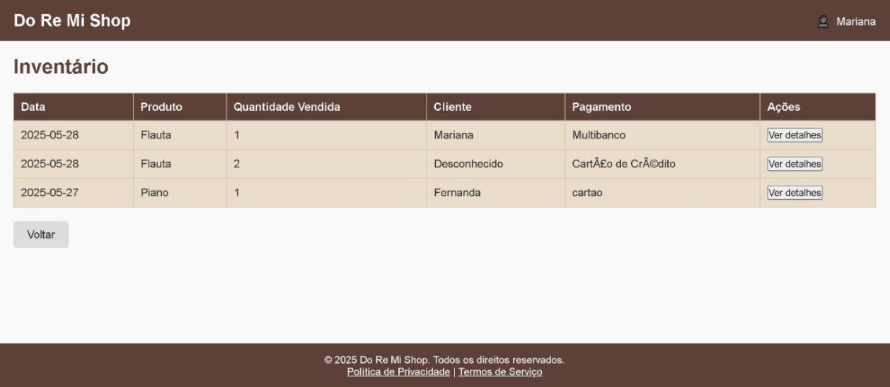
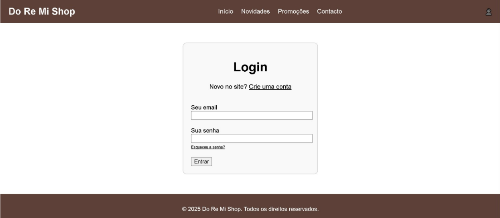

# Do Re Mi Shop 

Do Re Mi Shop is a Java web application developed as an academic project for managing an online music store.

The application includes different areas for customers, administrators, employees and suppliers, with features related to product management, sales, inventory and online purchases.

I was responsible for the full implementation of the application code.

## Features

### Customer

- Account registration
- Login
- Product search
- Shopping cart
- Purchase confirmation
- Product order evaluation
- Contact form

### Administrator

- Product management
- Add and edit products
- User account creation
- Inventory access
- Order management
- Sales management

### Employee

- Product management
- Physical store sales registration
- Inventory management

### Supplier

- Access to order information
- Order status management

## Technologies

- Java
- JSP
- Java Servlets
- JavaScript
- HTML
- CSS
- MySQL

## Database

The project uses a relational database to manage users, products, customers, suppliers, orders, sales and payments.

An available SQL script is included in the repository:

`database/do-re-mi-shop.sql`

> The SQL file may not represent the final version of the database used during development.

## Screenshots

### Home & Shopping Cart

  
  

### Product Management & Inventory

  
  

### Login

  

## Project Context

This project was developed during my Computer Engineering degree.

The application was created to simulate the management of an online and physical music store, combining server-side Java development, JSP interfaces and a relational database.

The project includes different user roles and workflows for customers, administrators, employees and suppliers.

## Development

The application code and implementation were developed by **Mariana Monteiro**.

## Author

**Mariana Monteiro**

- [GitHub](https://github.com/MarianaMonteiro79)
- [LinkedIn](https://www.linkedin.com/in/marianafmmonteiro/)
